---
hide:
  - toc
---

<!-- markdownlint-disable MD041 -->

  

    
    <h1>Agent2Agent (A2A) Protocol</h1>
  

## What is A2A Protocol?

Welcome to the **official documentation** for the **Agent2Agent (A2A) Protocol**, an open standard designed to enable seamless communication and collaboration between AI agents.

Originally developed by Google and now donated to the Linux Foundation, A2A provides the definitive common language for agent interoperability in a world where agents are built using diverse frameworks and by different vendors.

!!! abstract ""
    Build with
    **[{class="twemoji lg middle"} ADK](https://google.github.io/adk-docs/)** _(or any framework)_,
    equip with **[{class="twemoji lg middle"} MCP](https://modelcontextprotocol.io)** _(or any tool)_,
    and communicate with
    **{class="twemoji lg middle"} A2A**,
    to remote agents, local agents, and humans.

## Get started with A2A

- :material-play-circle:{ .lg .middle } **Video** Intro in <8 min

    <iframe width="560" height="315" src="https://www.youtube.com/embed/Fbr_Solax1w?si=QxPMEEiO5kLr5_0F" title="YouTube video player" frameborder="0" allow="accelerometer; autoplay; clipboard-write; encrypted-media; gyroscope; picture-in-picture; web-share" referrerpolicy="strict-origin-when-cross-origin" allowfullscreen></iframe>

- :material-book-open:{ .lg .middle } **Read the Introduction**

    Understand the core ideas behind A2A.

    [:octicons-arrow-right-24: What is A2A?](./topics/what-is-a2a.md)

    [:octicons-arrow-right-24: Key Concepts](./topics/key-concepts.md)

- :material-file-document-outline:{ .lg .middle } **Dive into the Specification**

    Explore the detailed technical definition of the A2A protocol.

    [:octicons-arrow-right-24: Protocol Specification](./specification.md)

- :material-application-cog-outline:{ .lg .middle } **Follow the Tutorials**

    Build your first A2A-compliant agent with our step-by-step Python quickstart.

    [:octicons-arrow-right-24: Python Tutorial](./tutorials/python/1-introduction.md)

- :material-code-braces:{ .lg .middle } **Explore Code Samples**

    See A2A in action with sample clients, servers, and agent framework integrations.

    [:fontawesome-brands-github: GitHub Samples](https://github.com/a2aproject/a2a-samples)

- :material-code-braces:{ .lg .middle } **Download the Official SDKs**

    [:fontawesome-brands-python: Python](https://github.com/a2aproject/a2a-python)

    [:fontawesome-brands-js: JavaScript](https://github.com/a2aproject/a2a-js)

    [:fontawesome-brands-java: Java](https://github.com/a2aproject/a2a-java)

    [:octicons-code-24: C#/.NET](https://github.com/a2aproject/a2a-dotnet)

    [:fontawesome-brands-golang: Golang](https://github.com/a2aproject/a2a-go)

## Why use the A2A Protocol

```mermaid
graph LR
    User(🧑‍💻 User) <--> ClientAgent(🤖 Client Agent)
    ClientAgent --> A2A1(**↔️ A2A**) --> RemoteAgent1(🤖 Remote Agent 1)
    ClientAgent --> A2A2(**↔️ A2A**) --> RemoteAgent2(🤖 Remote Agent 2)

    style User fill:#fdebd0,stroke:#e67e22,stroke-width:2px
    style ClientAgent fill:#d6eaf8,stroke:#3498db,stroke-width:2px
    style RemoteAgent1 fill:#d6eaf8,stroke:#3498db,stroke-width:2px
    style RemoteAgent2 fill:#d6eaf8,stroke:#3498db,stroke-width:2px
    style A2A1 fill:#ebedef,stroke:#909497,stroke-width:2px
    style A2A2 fill:#ebedef,stroke:#909497,stroke-width:2px
```

- :material-account-group-outline:{ .lg .middle } **Interoperability**

    Connect agents built on different platforms (LangGraph, CrewAI, Semantic Kernel, custom solutions) to create powerful, composite AI systems.

- :material-lan-connect:{ .lg .middle } **Complex Workflows**

    Enable agents to delegate sub-tasks, exchange information, and coordinate actions to solve complex problems that a single agent cannot.

- :material-shield-key-outline:{ .lg .middle } **Secure & Opaque**

    Agents interact without needing to share internal memory, tools, or proprietary logic, ensuring security and preserving intellectual property.

---

## How does A2A work with MCP?

{width="60%"}
{style="text-align: center; margin-bottom:1em; margin-top:1em;"}

A2A and [Model Context Protocol (MCP)](https://modelcontextprotocol.io/) are complementary standards for building robust agentic applications:

- **Model Context Protocol (MCP)**: Provides [agent-to-tool communication](https://cloud.google.com/discover/what-is-model-context-protocol). It's a complementary standard that standardizes how an agent connects to its tools, APIs, and resources to get information.
- **IBM ACP**: [Incorporated into the A2A Protocol](https://github.com/orgs/i-am-bee/discussions/5)
- **Cisco agntcy**: A framework that provides components to the Internet of Agents with discovery, group communication, identity and observability and leverages A2A and MCP for agent communication and tool calling.
- **A2A**: Provides agent-to-agent communication. As a universal, decentralized standard, A2A acts as the public internet that allows [ai agents](https://cloud.google.com/discover/what-are-ai-agents)—including those using MCP, or built with frameworks like agntcy—to interoperate, collaborate, and share their findings.
